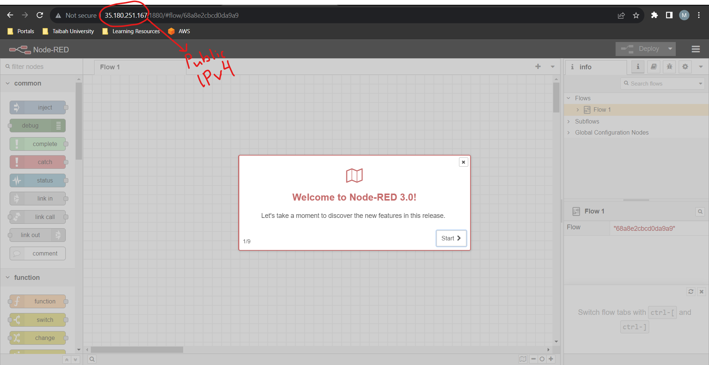
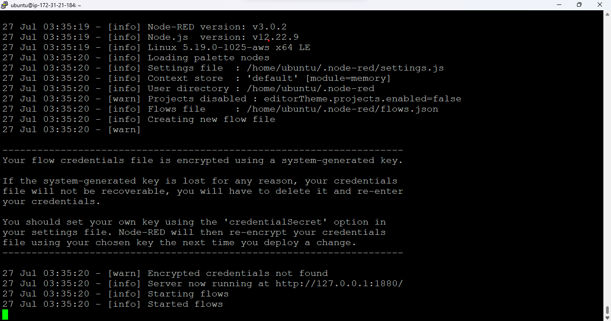

# Install Node-Red on AWS EC2 instance, and establishing MQTT connection between ESP32s and AWS IoT core

#### Overview

### Install Node-Red on AWS EC2 Instance

In this part, we will set up an Amazon EC2 instance and install Node-Red on it. Amazon EC2 (Elastic Compute Cloud) provides scalable computing capacity 
in the cloud, and Node-Red is a flow-based programming tool that allows us to easily connect devices, APIs, and online services.

## Install Node-Red on AWS EC2 Instance

1. **Create an AWS EC2 Instance:**
   - Sign in to your AWS account and navigate to the EC2 dashboard.
   - Click on "Launch Instance" to create a new EC2 instance.
   - Choose an Amazon Machine Image (AMI) that supports Ubuntu.
   - Configure the instance settings, such as instance type, VPC, subnet, and security groups. Make sure to add a new rule to allow incoming traffic on port 22 (SSH) and port 1880 (Node-Red).
   - Create or use an existing key pair for SSH access.

2. **Access the EC2 Instance via SSH:**
   - Download the .pem key file associated with your EC2 instance during the launch process.
   - Open PuTTY (or your preferred SSH client) and load the .pem key.
   - Enter the public IP address or DNS name of your EC2 instance.
   - Connect to the instance, and you should have a terminal window to the EC2 instance.


3. **Install Node.js and npm:**
   - Update the package manager and install Node.js and npm by running the following commands:
     ```bash
     sudo apt update
     sudo apt install -y nodejs npm
     ```

4. **Install Node-Red:**
   - Use npm to install Node-Red globally on the EC2 instance:
     ```bash
     sudo npm install -g --unsafe-perm node-red
     ```

5. **Start Node-Red:**
   - Start the Node-Red server by executing the following command:
     ```bash
     node-red
     ```

6. **Access Node-Red Dashboard:**
   - Open a web browser and navigate to your EC2 instance's public IP address or DNS name, followed by port 1880 (e.g., http://your_ec2_public_ip:1880).
   - You should see the Node-Red dashboard, and you can start creating flows and working with Node-Red.
#### Node-Red running on EC2, and accessed by my browser
|  |
|:----------------------------------:|

#### EC2 terminal on PuTTY
|  |
|:----------------------------------:|

